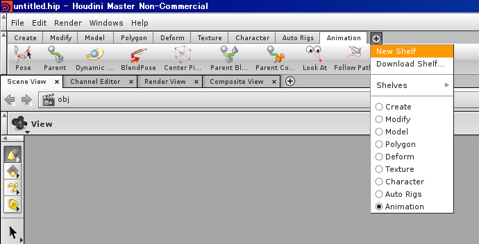
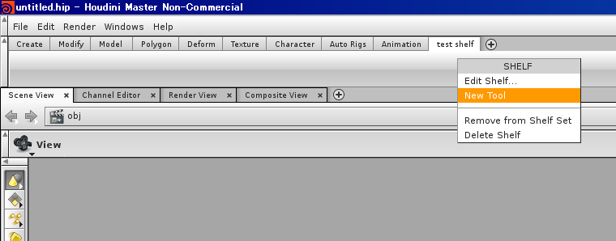
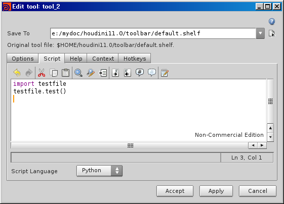

============
Introduction
============

Houdini と Python
=================

Houdini9 から、 Houdini 内部で実行可能なスクリプトとして Python が組み込まれています。
Python そのものについては `Python チュートリアル <http://www.python.jp/doc/release/tutorial/>`_ などを見ると良いでしょう。
ここでは、 Houdini 上で Python を使って開発するための情報を載せていきます。

Python について
---------------

Python を使うにあたり、参考になるウェブサイトや書籍を載せておきます。

* `みんなの Python 改訂版 <http://www.sbcr.jp/products/4797353952.html>`_
 * Python 入門書です。入門書ですが、 Python は Web の情報がかなり充実しているため、それほど必要ではないでしょう。
* `Python Japan User's Group <http://www.python.jp/Zope>`_
 * 日本における Python のユーザグループです。
 * 初めて Python に触る人は `Python の紹介 <http://www.python.jp/Zope/intro/>`_ や `Python Tutorial <http://www.python.jp/doc/release/tutorial/>`_ を読むと良いでしょう。
 * Python チュートリアルは `本にもなっています <http://www.oreilly.co.jp/books/9784873114422/>`_ 。
 * `Python 標準ライブラリリファレンス <http://www.python.jp/doc/release/library/>`_ はこの先末永くお世話になるドキュメントです。 Python を利用する上では必須といっても良いくらいの存在なので、標準ライブラリの使い方で迷ったらここを参照すると良いでしょう。
* `Python Cookbook <http://www.oreilly.co.jp/books/9784873112763/>`_
 * Python で「アレがやりたいけどどうやるの?」というときにみると良い本です。

インタラクティブシェルを立ち上げる
==================================

Houdini 上で Python による開発を行うにはいくつかの方法がありますが、まずはインタラクティブシェルを用いて Python を実行してみます。

Houdini 上で Python のインタラクティブシェルを立ち上げるには、以下のメニューを選択します。

.. image:: _static/images/menu.png

選択すると以下のように Python をコマンドとして立ち上げたものと同じシェルが立ち上がります。

.. image:: _static/images/pythonshell.png

補完機能
--------

Houdini の Python シェルは、基本的にはコマンドラインで Python コマンドを立ち上げたものと同等の機能を有していますが、若干違ったり、高機能な部分があります。

モジュール・オブジェクトなどの持っているメソッド・値などを表示したり補完したりする機能や、関数の引数の数を表示する機能などが追加されています。

以下は、標準モジュールの sys を使ってみた例です。

Python シェルで

.. code-block:: python

    >>> import sys
    >>> sys.

と入力すると、その下に sys モジュールに存在する関数と変数がリストされます。

.. image:: _static/images/completion.png

途中まで入力し、 tab で補完入力ができるので積極的に使いましょう。

モジュール
==========

Python は、 .py ファイルをモジュールとして import して使用できます。
モジュールを利用することで、開発した関数やクラスなどのプログラムをファイルに書き出しておき、 Houdini 内部で実行できるようになります。
モジュールとして使用する際は、以下のようなディレクトリに Python のソースファイル (.py ファイル) を置いておく必要があります。

- PYTHONPATH 環境変数で指定されたディレクトリ
- Windows であれば My Documents の下の houdini11.0\Scripts\Python (11.0 は使用時のバージョンが入る)
- Linux/Mac であれば $HOME/houdini11.0/scripts/python

Houdini 用のスクリプトであれば Houdini11.0 以下のディレクトリに置いておくのが良いでしょう。

モジュールからの実行
====================

シェルからの実行
----------------

作成したモジュールは、 import することで初めて使用できます。

:download:`このサンプルスクリプト <python/testfile.py>` を上記指定されたディレクトリにコピーして Houdini を実行してください。

Windows の場合は マイドキュメント\\Houdini11.0\\scripts\\python に、 Linux の場合は $HOME/houdini11.0/scripts/python が良いでしょう。

ソースの内容は以下のように test 関数が一つ定義されているだけです。

.. literalinclude:: python/testfile.py

Houdini を立ち上げた後、 Python シェルを実行し、以下のように入力します。

.. code-block:: python

    >>> import testfile
    >>> testfile.test()

これにより、 testfile.py というファイルで定義されている test という関数を実行できます。
実行した結果、以下のように表示されれば成功です。

.. code-block:: python

    testing

shelf からの実行
----------------

Python シェルからの実行を行う場合、何らかのツールを開発している際は良いのですが、制作作業で使用する場合は手間です。
そのような場合は shelf に登録してクリック一発で実行できるようにすると良いでしょう。

shelf に登録するために、以下のメニューから New Shelf を選択し、適当なタブを作ります。

ここでは test shelf を作ることにします。

作った shelf のタブをクリックして選択した後、タブの中身を追加するために右クリックし、 New Tool を選択します。

すると、以下のように新しいウィンドウが表示されるので、 script タブを選択し、先ほどのようにスクリプトを入力して Accept で完了します。

test shelf に新しいメニューが追加され、このメニューをクリックするだけで先ほどのスクリプトが実行されるようになりました。

