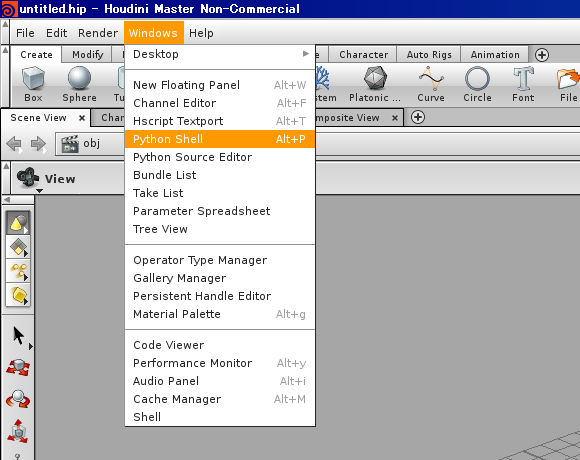
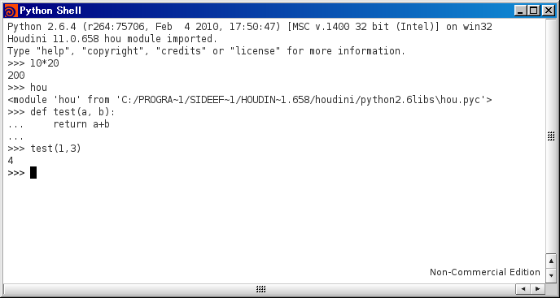
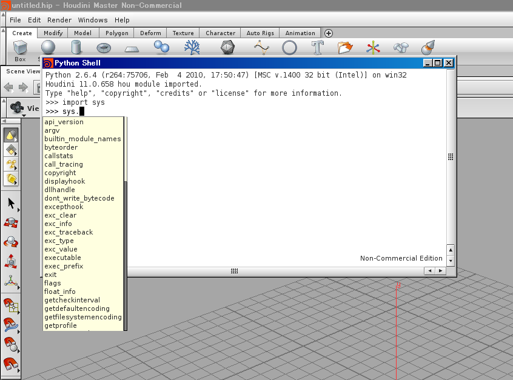

============
Introduction
============

Houdini と Python
=================

Houdini9 から、 Houdini 内部で実行可能なスクリプトとして Python が組み込まれています。
Python そのものについては `Python チュートリアル <http://www.python.jp/doc/release/tutorial/>`_ などを見ると良いでしょう。
ここでは、 Houdini 上で Python を使う上での情報のみを載せていきます。

インタラクティブシェルを立ち上げる
==================================

Houdini 上で Python による開発を行うにはいくつかの方法がありますが、まずはインタラクティブシェルを用いて Python を実行してみます。

Houdini 上で Python のインタラクティブシェルを立ち上げるには、以下のメニューを選択します。

選択すると以下のように Python をコマンドとして立ち上げたものと同じシェルが立ち上がります。

補完機能
--------

Houdini の Python シェルは、基本的にはコマンドラインで Python コマンドを立ち上げたものと同等の機能を有していますが、若干違ったり、高機能な部分があります。

モジュール・オブジェクトなどの持っているメソッド・値などを表示したり補完したりする機能や、関数の引数の数を表示する機能などが追加されています。

以下は、標準モジュールの sys を使ってみた例です。

Python シェルで

.. code-block:: python

    >>> import sys
    >>> sys.

と入力すると、その下に sys モジュールに存在する関数と値がリストされます。

途中まで入力し、 tab で補完入力ができるので積極的に使いましょう。

モジュール
==========

Python は、 .py ファイルをモジュールとして import して使用できます。
モジュールとして使用する際は、以下のようなディレクトリに Python のソースファイルを置いておく必要があります。

- PYTHONPATH 環境変数で指定されたディレクトリ
- Windows であれば My Documents の下の houdini11.0\Scripts\Python (11.0 は使用時のバージョン数が入る)
- Linux/Mac であれば $HOME/houdini11.0/scripts/python

Houdini 用のスクリプトであれば Houdini11.0 以下のディレクトリに置いておくのが良いでしょう。

