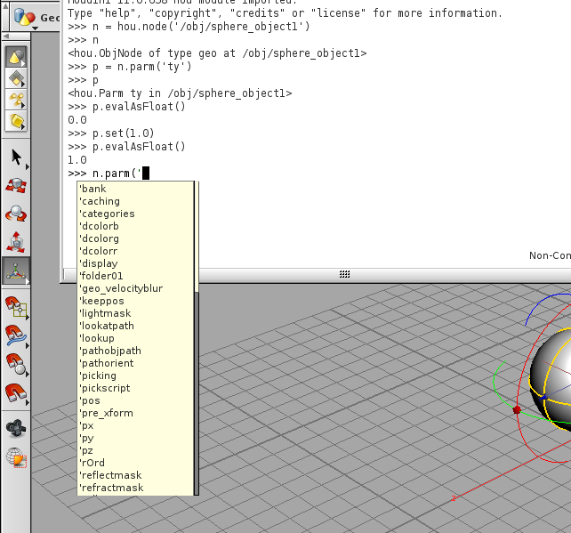

===========
Node の操作
===========

Node オブジェクト
=================

Houdini のシーン上に存在するすべての要素(ジオメトリ・カメラ・マテリアル・画像等々)はすべてノードとして扱われています。
hou モジュールでは、すべてのオブジェクトをノード単位で扱えます。

以下は /obj/sphere_object1 のノードを取得する例です。

.. code-block:: python

    >>> n = hou.node('/obj/sphere_object1')
    >>> n
    <hou.ObjNode of type geo at /obj/sphere_object1>

hou.node(' と打った後に少し待つと、ノードパスの補完候補が表示されます。
メソッドやモジュール名と同様に補完入力が可能です。

.. image:: _static/images/node.png

選択しているノードを取得する
----------------------------

現在 UI 上で選択しているノードのオブジェクトを取得するには、 hou.selectedNodes 関数を使用します。
この館数を実行すると、選択しているノードオブジェクトが返されます。

.. code-block:: python

    >>> nodes = hou.selectedNodes()
    >>> nodes
    (<hou.ObjNode of type geo at /obj/sphere_object1>,)

selectedNodes の結果を for 文で反復処理することで、一つ一つのノードに対して処理を行えます。

.. code-block:: python

    >>> for node in nodes:
    ...     print node.name()
    ...
    sphere_object1

Node のパラメータ
=================

ノードには、 UI 上から設定できるパラメータが存在します。
これらのパラメータは、ノードオブジェクトから読み書きできます。
パラメータは、ノードの parm メソッドにパラメータ名を渡すことで取得できるパラメータオブジェクトから読み書きを行います。

parm メソッドも node 関数同様に引数の文字列を入力する際に、候補となるパラメータ名が表示され、補完入力ができます。

以下は sphere object の ty パラメータを読み書きする例です。
パラメータオブジェクトの eval() メソッドで値を取得して表示しています。
また、 set() メソッドを使用すると、パラメータに値を設定できます。

ty は translate パラメータの y 要素を表すパラメータオブジェクトなので、この結果 sphere_object1 の y 座標が 1.0 に設定されます。

.. code-block:: python

    >>> n = hou.node('/obj/sphere_object1')
    >>> p = n.parm('ty')
    >>> p
    <hou.Parm ty in /obj/sphere_object1>
    >>> p.eval()
    0.0
    >>> p.set(1.0)
    >>> p.eval()
    1.0

Node を辿る
===========

親子関係
--------

ノードは、親子関係を持ったツリー構造として表現されています。
すべてのノードは / (root) ノードの下に存在し、 / ノードからすべて辿ることができます。

あるノードの子ノードの一覧を取得するには、 children() メソッドを使用します。

.. code-block:: python

    >>> n = hou.node('/obj')
    >>> n.children()
    (<hou.ObjNode of type geo at /obj/sphere_object1>,)

また、 parent() メソッドを使用することでノードの親ノードを取得できます。

.. code-block:: python

    >>> n = hou.node('/obj/sphere_object1')
    >>> n.parent()
    <hou.Node at /obj>

入出力
------

ノードオブジェクトからノードに対する入力と出力を辿ることができます。

:download:`このサンプルシーン <_static/scenes/blend.hipnc>` には、 box, sphere, blend のノードがあります。

このシーンの中の blend ノードから、入力ノードを取得するには、ノードの inputs メソッドを使用します。

.. code-block:: python

    >>> blend = hou.node('/obj/blend1')
    >>> blend.inputs()
    (<hou.ObjNode of type geo at /obj/box_object1>, <hou.ObjNode of type geo at /obj/sphere_object1>)

また、 box ノードから出力先ノードを取得するには、 ノードの outputs メソッドを使用します。

.. code-block:: python

    >>> box = hou.node('/obj/box_object1')
    >>> box.outputs()
    (<hou.ObjNode of type blend at /obj/blend1>,)

それぞれのメソッドの結果は、ノードオブジェクトのタプルなので、同様の処理を再帰的に行うことも可能です。

Node の接続
===========

ノードどうしの接続を設定する場合は、 setInput メソッドを指定します。

以下の例では n1, n2 をノードオブジェクトとして、 n2 ノードの 0 番目の入力ノードとして n1 ノードを設定しています。

.. code-block:: python

    >>> n2.setInput(0, n1)
    >>> n2.inputs()
    (<hou.ObjNode of type geo at /obj/sphere_object1>,)

setInput の一番目の引数は、入力ノードのインデックスです。インデックスは 0 から始まり、それぞれのインデックスに対して入力ノードを指定できます。
既にそのインデックスに入力ノードが設定されていた場合、その接続は新しいノードと置き換えられます。

特定インデックスのノードの接続を切る場合は、 setInput のノード引数を None とすることで接続を切ることができます。

.. code-block:: python

    >>> n2.setInput(0, None)
    >>> n2.intpus()
    ()

setInput ではなく insertInput を使用すると、ノードの接続の途中に入力ノードを追加することができます。

.. code-block:: python

    >>> n1.setInput(0, n2)
    >>> n1.inputs()
    (<hou.ObjNode of type geo at /obj/sphere_object2>,)
    >>> n1.insertInput(0, n3)
    >>> n1.inputs()
    (<hou.ObjNode of type geo at /obj/sphere_object3>, <hou.ObjNode of type geo at /obj/sphere_object2>)

サンプルコード
==============

ノードの走査とパラメータ入出力の小さなサンプルです。

処理内容は、 /obj 以下にある geo ノードを引数で渡した値の分だけ移動させるだけのものです。

:download:`サンプルソース <python/nodemanip.py>`

.. literalinclude:: python/nodemanip.py

使い方は、サンプルのソースをモジュールとして読み込める場所に置き、以下のようにして実行します。

以下の例では geo オブジェクトを x 方向に 5 だけ動かします。

.. code-block:: python

    >>> import nodemanip
    >>> nodemanip.move_objects(5, 0, 0)

使用したメソッドなど
====================

この章で使用した関数やメソッドのリファレンスです。

.. currentmodule:: hou

.. function:: hou.node(node_path)

    node_path で指定したノードのオブジェクトを取得します

.. function:: hou.selectedNodes()

    選択しているノードのオブジェクトをタプルで返します

.. class:: hou.Node()

  houdini のノードオブジェクトです

  .. method:: name(self)

    ノードオブジェクトの名前を返します

  .. method:: children(self)

    ノードの子ノードをタプルで返します

  .. method:: parent(self)

    ノードの親ノードを返します

  .. method:: outputs(self)

    ノードオブジェクトに接続されている出力先ノードの名前をタプルで返します

  .. method:: inputs(self)

    ノードオブジェクトに接続されている入力元ノードの名前をタプルで返します

  .. method:: parm(self, name)

    name で識別されるノードのパラメータオブジェクトを返します

  .. method:: setInput(self, input_index, node[, output_index])

    ノードの input_index 番目の入力ノードとして node を設定します。
    input_index 番目に既にノードが接続されていた場合は、置き換えます。
    ノードの接続を切る場合は、 node に None を指定して setInput を呼び出します。

  .. method:: insertInput(self, input_index, node[, output_index])

    ノードの input_index 番目の入力ノードとして node を挿入します。
    既にその位置に入力ノードが存在している場合は、それ以降の入力インデックスが後にずれます。

.. class:: hou.Parm()

  ノードのパラメータオブジェクトです

  .. method:: eval(self)

    パラメータの値を取り出します

  .. method:: set(self, value)

    パラメータの値を value にセットします

